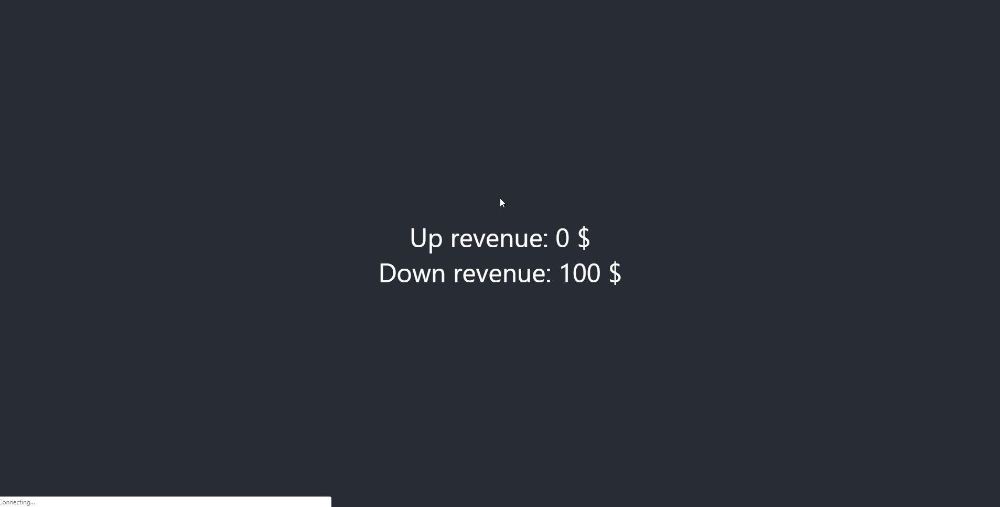

# Number Counter

> This will help you make counter and it will compatible with all browser.
> It has flexibility to count upward as well as downward.


## Installation
```
npm install number-counter 
```

## Usage
```
import NumberCounter from 'number-counter';
```

### Demo example 
```
<NumberCounter end={100} delay={4}/>
```

This will start a counter and transition from `0` to `100` on render.

### Render prop example
```
// import number counter
import NumberCounter from 'number-counter';

class App extends Component {
  render() {
    return (
      <div className="App">
        <header className="App-header">
        
          // number counter for upward count.
          <NumberCounter end={100} delay={5} className="increment" preFix="Up revenue:" postFix="$"/>
          
          // number counter for downward count.
          <NumberCounter start={100} delay={5} className="increment" preFix="Down revenue:" postFix="$" reverse={true}/>
          
        </header>
      </div>
    );
  }
}

export default App;
``` 



[View Demo](https://github.com/skychavda/number-counter-npm)

## API

### Props

Name | Type | Description | Default
:--- | :--- | :--- | :---
start | number | Starting value of counter.| `start={0}`
end | number | Ending value of counter. | `end={10}`
className | string | CSS class name of element. | `null`
delay | number | Duration in second. | `2s`
preFix | string | Append text before counter value. | `null`
postFix | string | Append text after counter value. | `null`
reverse | boolean | Count downward. | `false`
